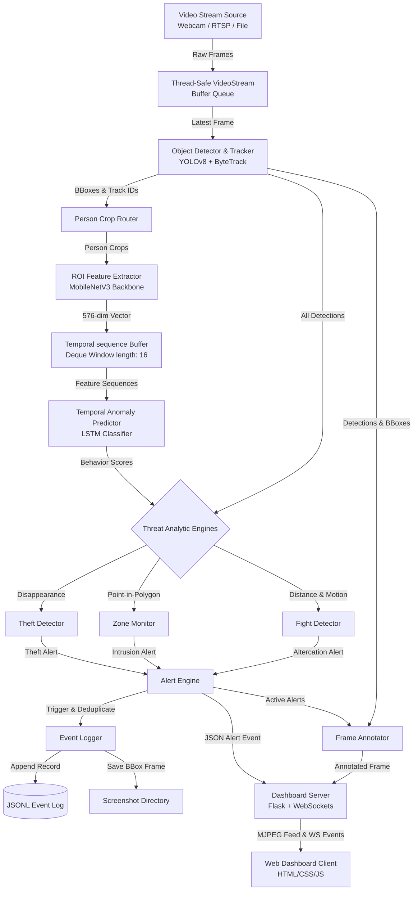

# AegisEdge: Smart Surveillance System Documentation

AegisEdge is a real-time, high-performance Smart Surveillance Edge AI system designed to run on local workstations and edge platforms (NVIDIA Jetson Nano/Orin, Raspberry Pi 4/5). It processes live video streams (USB webcams, RTSP network feeds, or local files) to track multiple objects and detect security anomalies.

This document serves as the comprehensive guide covering all features, system architecture, step-by-step setup on a new laptop, execution instructions, training, and troubleshooting.

---

## 📄 Table of Contents
1. [Core Features](#1-core-features)
2. [System Architecture & Threading](#2-system-architecture--threading)
3. [Step-by-Step New Laptop Setup](#3-step-by-step-new-laptop-setup)
4. [Execution Guide](#4-execution-guide)
5. [Configuration Settings (`config/default_config.yaml`)](#5-configuration-settings)
6. [Training & Edge Export](#6-training--edge-export)
7. [Unit Testing](#7-unit-testing)
8. [Troubleshooting Guide](#8-troubleshooting-guide)

---

## 1. Core Features

### 📹 Real-Time Multi-Object Tracking
* **Technology:** Integrates **YOLOv8** (Object Detection) with **ByteTrack** (Multi-Object Tracking).
* **Functionality:** Tracks bounding boxes for people, backpacks, handbags, suitcases, laptops, and cell phones. Managed by Kalman filters, minimizing track ID switches even under partial occlusions.
* **Trail History:** Computes speed and direction using rolling sequence displacement calculations of the bottom-center coordinate of tracked targets.

### 🚨 Restricted Zone Intrusion Detection
* **Technology:** Feet coordinate tracking + **Ray-Casting Point-in-Polygon (PIP)** algorithm.
* **Functionality:** Users can define complex, non-rectangular polygons as restricted zones. The system computes a person's ground point (feet) and casts a horizontal ray across the polygon's edges. An odd number of crossings indicates that the person is inside the zone.
* **Edge-Triggered Transitions:** Features a state machine (`enter`, `inside`, `exit`) to log alerts precisely on state transition, preventing duplicate logging when a person remains inside a zone.

### 💻 Retail & Office Asset Theft Detection
* **Technology:** Spatial-temporal state machine tracking object disappearance.
* **Functionality:** Monitors specified target assets (e.g., laptops, backpacks, cell phones). It dynamically detects when a monitored asset disappears from the bounding box tracker.
* **Proximity Association:** If an asset vanishes, the system identifies the last person tracked within close proximity to the asset's last known location, flags them as the suspect, and raises a theft alert.

### 🥊 Altercation & Fight Detection
* **Technology:** Hybrid heuristic + deep learning classification.
* **Proximity Gate:** Triggers when two or more people are within a close Euclidean distance (e.g., 150 pixels).
* **Dense Optical Flow:** Computes **Farneback Dense Optical Flow** magnitudes in consecutive frames to measure overall scene kinetic energy.
* **PyTorch LSTM Sequence Model:** Extracts spatial pose features of candidates using a pre-trained **MobileNetV3-Small** ROI feature extractor and feeds a 16-frame temporal sequence into a PyTorch LSTM model to classify behavior.

### 📊 Premium Glassmorphic Web Dashboard
* **Technology:** Flask, Flask-SocketIO (WebSockets), HTML5, Vanilla CSS3, Javascript.
* **Visual Style:** Harmony-tailored glassmorphism theme using Outfit & Plus Jakarta Sans typography.
* **Capabilities:** 
  - Real-time MJPEG video stream showing YOLO bounding boxes, tracking paths, and restricted zones.
  - Sidebar detailing real-time hardware metrics (inference FPS, CPU usage).
  - Dynamic notification cards for active alerts.
  - Clickable alerts to open a modal detailing the threat category, suspect ID, timestamp, and the high-resolution event screenshot.

### 🛡️ Throttling & Output Logging
* **Technology:** Double-buffered event cooldown registry.
* **Functionality:** Suppresses redundant alerts for the same event type within a configurable time frame (e.g., 30 seconds).
* **Storage:** Append-only JSONL files (`logs/events.jsonl`) store structured incident records. Captured alert snapshots are saved under `logs/alert_screenshots/` with unique hash-based filenames.

---

## 2. System Architecture & Threading

To prevent frame drops and UI freezes, AegisEdge separates operations into a **three-tier multi-threaded model**:



1. **Capture Thread (`VideoStream`):** Continuously queries the input source at full FPS and keeps a small FIFO buffer of 2 frames. It drops old frames if the processing thread falls behind, ensuring zero lag accumulation.
2. **Main Pipeline Thread (`SurveillancePipeline`):** Runs YOLOv8 tracking, extracts ROI features, runs analytical classifiers, draws annotations, and emits logs.
3. **Web Server Thread (`DashboardServer`):** Runs Flask and SocketIO. It broadcasts events, serves resources, and streams video frames over HTTP without interfering with the model processing time.

---

## 3. Step-by-Step New Laptop Setup

This guide walks you through setting up AegisEdge on a brand new computer.

### 📋 Prerequisites
Make sure your system has:
1. **Python (version 3.8 to 3.11)**. Verify version by running `python --version`.
2. **Git**. Check by running `git --version`.
3. **C++ Build Tools** (necessary to compile `psutil` or `scipy` if prebuilt binaries are unavailable):
   - **Windows:** Download and install [Visual Studio Build Tools](https://visualstudio.microsoft.com/visual-cpp-build-tools/), select "Desktop development with C++", and install.
   - **macOS:** Open terminal and run `xcode-select --install`.
   - **Linux:** Run `sudo apt update && sudo apt install build-essential python3-dev`.

---

### 💻 Step-by-Step Installation Commands

#### 1. Open Terminal & Clone Codebase
Open **PowerShell** (Windows) or **Terminal** (macOS/Linux):
```bash
# Clone the repository (or copy folders manually)
git clone https://github.com/yourusername/smart-surveillance-system.git
cd smart-surveillance-system
```

#### 2. Create Python Virtual Environment
A virtual environment ensures AegisEdge dependencies do not clash with other programs:
```bash
# Create the environment
python -m venv venv
```

#### 3. Activate the Virtual Environment
* **Windows (PowerShell):**
  ```powershell
  # If you get an execution policy error, run this command first:
  Set-ExecutionPolicy -ExecutionPolicy RemoteSigned -Scope CurrentUser
  
  # Then activate:
  .\venv\Scripts\Activate.ps1
  ```
* **Windows (Command Prompt):**
  ```cmd
  .\venv\Scripts\activate.bat
  ```
* **macOS / Linux:**
  ```bash
  source venv/bin/activate
  ```

Once activated, your terminal prompt will be prefixed with `(venv)`.

#### 4. Install Dependencies
Run these commands to install the required libraries (approx. 300MB download):
```bash
# Ensure pip is up to date
pip install --upgrade pip setuptools wheel

# Install dependencies
pip install -r requirements.txt

# Install psutil for dashboard hardware readings
pip install psutil
```

---

## 4. Execution Guide

AegisEdge provides scripts for virtual simulation, live cameras, and video files. Make sure your virtual environment is activated before running.

### Option A: Out-of-the-Box Simulated Demo (No Camera Needed)
This option creates simulated actors, walks them through restricted zones, triggers fights, and stages a laptop theft to demonstrate the dashboard features:
```bash
python scripts/run_demo.py
```
* **How to test:** 
  1. Once started, open **Chrome** (or any modern browser) and go to: **`http://localhost:5000`**
  2. View the glassmorphic UI. Watch the timeline of alerts trigger on the dashboard:
     - **0s - 4s:** Actor #2 enters the restricted red polygon. An **Intrusion Alert** triggers.
     - **8s - 10s:** Actor #3 & #4 approach, moving chaotically. A **Fight Alert** triggers.
     - **17s - 21s:** Actor #5 walks to the desk and steals a laptop. A **Theft Alert** triggers showing Actor #5 as the suspect.
  3. Click on the alert cards to view details and inspect the screenshot.

### Option B: Live Webcam Surveillance
To run AegisEdge using a connected USB webcam or built-in camera:
```bash
python scripts/run_surveillance.py --source 0
```
*(If you have multiple webcams connected, you can try `--source 1` or `--source 2`)*

### Option C: File Video Surveillance
To run AegisEdge processing a recorded local MP4 or AVI file:
```bash
python scripts/run_surveillance.py --source "path/to/your/video.mp4"
```

---

## 5. Configuration Settings

All system behaviors are governed by `config/default_config.yaml`. Here are the primary settings you can customize:

| Category | Key | Default | Description |
|---|---|---|---|
| **Video** | `video.source` | `0` | Camera index or file path. |
| | `video.width` / `video.height` | `640` / `480` | Frame size. Smaller is faster. |
| **Detection**| `detection.model` | `yolov8n.pt` | YOLO weights model. Nano is optimized for CPU. |
| | `detection.device` | `cpu` | Hardware device (`cpu` or `cuda`). |
| | `detection.confidence_threshold`| `0.5` | Bounding box visibility filter. |
| **Anomaly** | `anomaly.fight_detection.proximity_threshold`| `150` | Pixels max distance between people to check for fight. |
| | `anomaly.fight_detection.motion_threshold`| `30.0` | Dense optical flow kinetic energy trigger threshold. |
| | `anomaly.theft_detection.monitored_objects`| `["laptop", "cell phone"]`| Classes of assets monitored for theft alerts. |
| **Zones** | `zones` | *Polygon coords* | Vertex coordinates defining restricted areas. |
| **Alerting** | `alerting.cooldown_seconds` | `30` | Seconds to wait before filing a duplicate alert. |
| | `alerting.log_file` | `logs/events.jsonl` | Append-only event log target file. |

---

## 6. Training & Edge Export

### 🧠 Training the Anomaly LSTM Classifier
You can train a custom sequence model on posture feature sequences. A synthetic trainer is included to verify code execution immediately:
```bash
python scripts/train_anomaly_model.py --epochs 15 --samples 1200
```
This generates sequence feature packages and trains the PyTorch LSTM, saving the best weights model to `models/lstm_anomaly_model.pth`.

### ⚡ Exporting to ONNX & TensorRT (Edge Deployment)
For high-performance runtimes on edge boards like the NVIDIA Jetson:
```bash
python scripts/export_model.py
```
This converts the PyTorch `.pth` model to an optimized `.onnx` model (`models/lstm_anomaly_model.onnx`) and outputs the compiled CUDA TensorRT deployment guidelines.

---

## 7. Unit Testing

A comprehensive unit test suite is included in the `tests/` directory to verify calculations, geometry formulas, tracker histories, and pipeline hooks.

To execute tests and verify code health:
```bash
python -m unittest discover -s tests -v
```

All tests should output `ok` and finish with `OK` at the bottom of the log.

---

## 8. Troubleshooting Guide

| Issue | Typical Cause | Resolution |
|---|---|---|
| **`ModuleNotFoundError: No module named 'ultralytics'`** | Virtual environment is not activated or packages didn't install. | Run `.\venv\Scripts\Activate.ps1` (or `source venv/bin/activate` on Linux/macOS) and run `pip install -r requirements.txt`. |
| **`Cannot open video source: 0`** | Another application is using the webcam or index is wrong. | Close programs like Teams, Zoom, and Skype. If using a secondary webcam, edit `config/default_config.yaml` to set `video.source: 1`. |
| **Web browser shows a blank video feed** | The YOLO model is downloading on first run. | YOLOv8 downloads weights from the internet (`~6MB`) during its first initiation. Wait 10-15 seconds for it to finish downloading. |
| **`Script execution is disabled on this system`** | Windows PowerShell execution restriction. | Open PowerShell as Administrator and run `Set-ExecutionPolicy RemoteSigned -Scope CurrentUser`, then try activating again. |
| **`Port 5000 is already in use`** | Another web service is running on port 5000. | Open `config/default_config.yaml` and modify `dashboard.port` to `5001` or another open port. |
| **FPS is extremely low (1-2 FPS)** | High resolution or heavy model on CPU. | Keep width/height at `640x480`. In `config/default_config.yaml`, ensure `detection.model` is `yolov8n.pt` (not `yolov8m.pt` or `yolov8x.pt`). |
