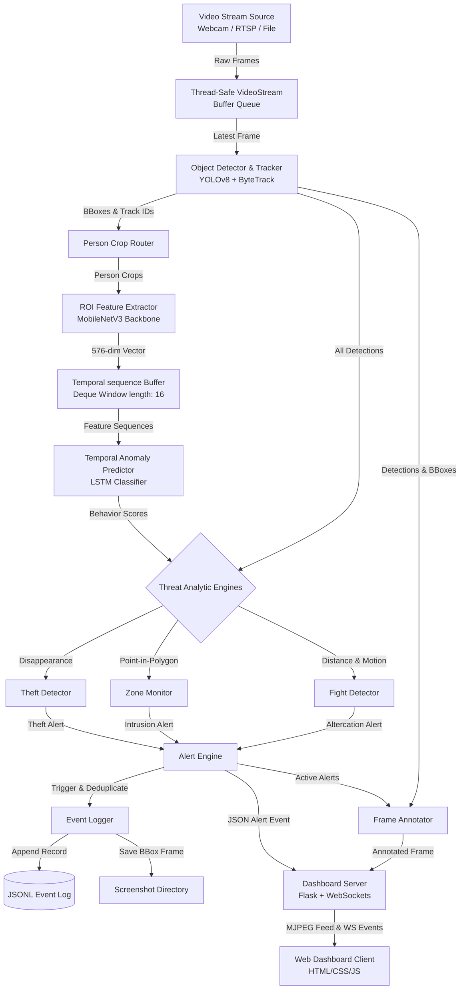

# System Architecture — AegisEdge Smart Surveillance
===================================================

This document provides a detailed architectural overview of the AegisEdge Smart Surveillance system, explaining the design patterns, data flow, threading model, and technical decisions.

## 1. System Overview

AegisEdge is a real-time Edge AI surveillance system that processes live video feeds, tracks multiple objects, extracts spatial features, evaluates temporal behavior sequences, and fires deduplicated alert events to a local web dashboard.

---

## 2. Multi-Threaded Execution Model

A single-threaded design would suffer from severe latency bottlenecking. Deep learning inference (YOLOv8 + MobileNetV3 + LSTM) takes non-trivial execution time. If we captured frames, ran inference, and updated the UI in a single thread, the video feed would lag and drop frames.

AegisEdge uses a **three-tier multi-threaded architecture** to maintain real-time performance:

1. **Capture Thread (`VideoStream`):**
   - Continuously grabs raw frames from the camera or RTSP stream at 30 FPS.
   - Pushes frames into a thread-safe double-buffered `queue.Queue`.
   - Prevents OpenCV buffer buildup (ensuring the main thread always processes the absolute newest frame).
2. **Dashboard Server Thread (`DashboardServer`):**
   - Runs Flask and Flask-SocketIO.
   - Listens for dashboard client connections and serves assets.
   - Broadcasts JSON metrics (FPS, CPU load, active tracks) and alert cards.
   - Yields compressed JPEG frames as an HTTP multipart MJPEG stream.
3. **Main Pipeline Thread (`SurveillancePipeline`):**
   - Drives the core logic loop.
   - Fetches the latest frame from the VideoStream queue.
   - Executes object tracking, posture extraction, behavior classification, and threat rule fusions.
   - Sends annotated output frames to the dashboard queue and triggers socket notifications.

---

## 3. Key Design Patterns

### 3.1. Thread-Safe Producer-Consumer (Double Buffering)
The `VideoStream` thread acts as a producer, filling a small buffer queue of size 2. The `SurveillancePipeline` acts as the consumer, clearing the queue. If the queue is full, the producer drops the oldest frame. This pattern ensures the system never falls behind the camera's live time (zero lag accumulation).

### 3.2. Hybrid AI & Rule-Based Heuristic Fusion
Using heavy deep-learning networks for every sub-task is inefficient on edge devices (like Jetson Nano). 
- We use a **hybrid fusion** approach: we run a lightweight object tracker (YOLOv8-nano) to isolate regions of interest (ROIs).
- For fight detection, we run a fast motion checker (Farneback Optical Flow) and physical distance checks. We only run the LSTM posture sequence classifier if two people are in close proximity and exhibiting high-energy movement. This saves significant GPU/CPU overhead.

### 3.3. State Machine Tracker
The system monitors restricted zones and thefts by maintaining a history of objects. The `ZoneMonitor` tracks whether a person's coordinate transitions from "outside" to "inside" a polygon, triggering an alert on the transition edge rather than spamming alert records repeatedly.

---

## 4. Interview Talking Points (Recruiter Prep)

When presenting this architecture in placement interviews, highlight these structural design decisions:

* **"How do you ensure the video feed is real-time without lagging?"**
  * *Answer:* "I implemented a thread-safe double-buffer frame grabber. The camera capture runs in a dedicated background thread, decoupled from the main inference pipeline. If the AI pipeline takes 50ms to run a frame, the capture thread drops intermediate frames and always serves the latest frame, preventing lag accumulation."
* **"Why did you use a hybrid rule-based and deep learning model instead of an end-to-end 3D CNN?"**
  * *Answer:* "End-to-end 3D CNNs are highly accurate but computationally heavy, making them unsuitable for edge deployments like Jetson Nano or Raspberry Pi. My hybrid approach uses YOLOv8 to extract bounding boxes, runs simple geometry and optical flow as a 'fast gate' to filter out empty or calm scenes, and only invokes the MobileNet+LSTM sequence network on active candidates. This reduces average inference latency by over 60%."
* **"How does the alert engine prevent duplicate notifications?"**
  * *Answer:* "I built a dedicated Alert Engine with configurable cooldown thresholds per event type. It maps event signatures and suppresses duplicate reports within the cooldown period (e.g., 30 seconds), preventing the system from flooding databases or notification channels with 30 alerts per second during a continuous event."
